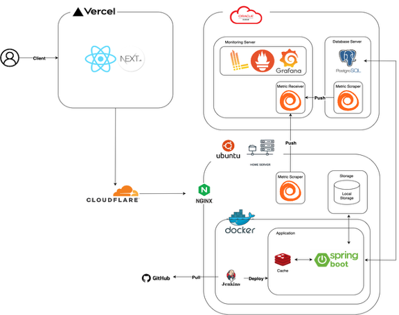

  
  <h1 style="margin-left: 10px;">Easy to Web</h1>

손쉽게 홈페이지를 게시·공유할 수 있는 **동시편집 Web Builder** 서비스.   
서버 중심 CRDT 동기화, 인증/인가, 프로젝트 게시/이력과 함께 전문 에디팅 UX를 제공.

---

## 1. 프로젝트 소개
- **동시편집 기반 웹 빌더**: Yjs(CRDT) + WebSocket, 서버 병합으로 정합성 보장
- **안정적 인증/인가**: 이메일 인증 + Google OAuth, JWT(Access/Refresh) 갱신 흐름
- **운영 품질**: Prometheus·Grafana·Loki·Alloy 모니터링, Slack 알림
- **아키텍처**: 헥사고날 아키텍처(도메인 중심), BE/Infra 설계로 확장·유지보수성 확보

| 항목               | 링크                                                                                                          |
|------------------|-------------------------------------------------------------------------------------------------------------|
| 프로젝트 소개          | [Easy To Web](./docs/EasyToWeb_project.pdf)                                                                 |
| 서비스 (운영)         | https://easytoweb.store/                                                                                    |
| 서비스 (개발)         | https://dev.easytoweb.store/                                                                                |
| 개발문서             | https://gregarious-saga-c52.notion.site/2300ecbd630780acae75dd73f5700051?v=2300ecbd63078178ab80000c61e94b27 |
| API 문서 (Swagger) | https://dev-api.easytoweb.store/swagger/swagger-ui/index.html                                               |
| ERD              | https://gregarious-saga-c52.notion.site/ERD-2300ecbd6307813ba163e1b49397da3a                                |

---

## 2. 기술스택
- **Backend**: Java 21, Spring Boot 3.4.1, Spring Security, PostgreSQL, Redis
- **Frontend**: React, Next.js, TypeScript, Craft.js
- **Collab/CRDT**: Yjs(y-crdt), WebSocket
- **Infra/배포**: Docker, Nginx, Cloudflare Tunnel, Oracle Cloud, Jenkins, Vercel
- **Observability**: Prometheus, Grafana, Loki, Alloy, Spring Actuator
- **기타**: JNI(Rust ↔ Java 연동)

---

## 3. 구성

  
Infra Architecture

---

## 4. 주요 기능
- **프로젝트**: 초대/권한, 생성·관리·삭제, 게시 이력, 클릭 가능한 UI, 스타일 계승 발행
- **인증/보안**: 이메일 인증, OAuth(Google), JWT 로그인, 토큰 재발급
- **파일/미디어**: 서버 업로드, image -> WebP 인코딩
- **운영 품질**: 성능 측정(TPS/RT/리소스), 대시보드/알림, CI/CD 자동화

